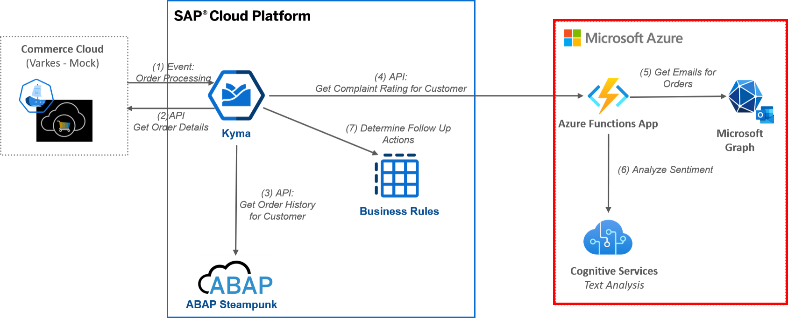

# Durable Function for Email and Sentiment Analysis

This repository contains the source code for the Azure Durable Function executing an email search via Microsoft Graph and an sentiment analysis via Cognitive Services.

For details and the end2end context please visit the blog post [Building a Side-by-side Extension with Kyma and Microsoft Azure](https://blogs.sap.com/2021/01/12/building-a-side-by-side-extension-with-kyma-and-microsoft-azure/)
